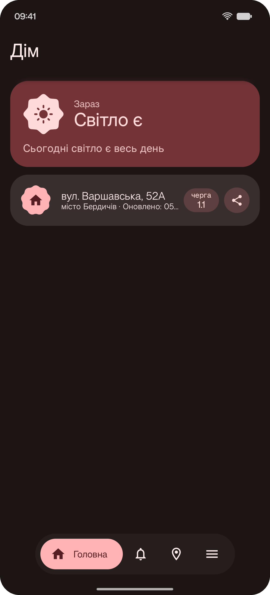
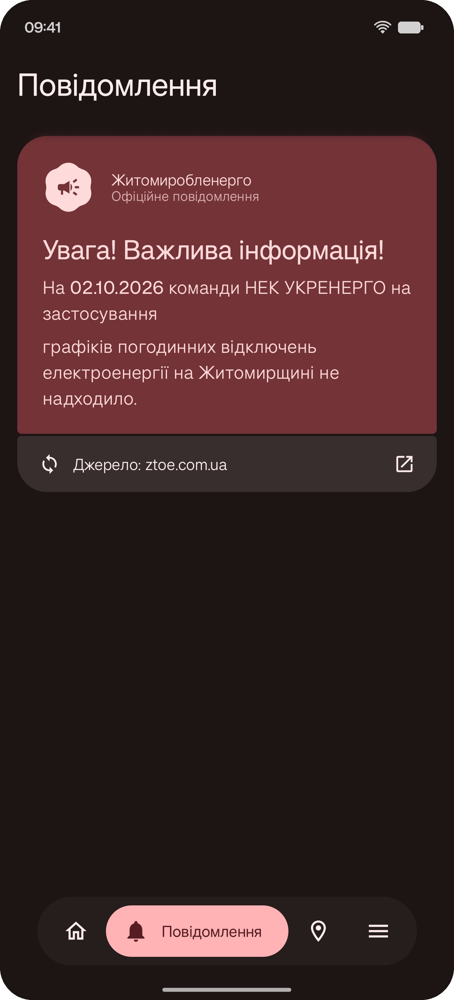
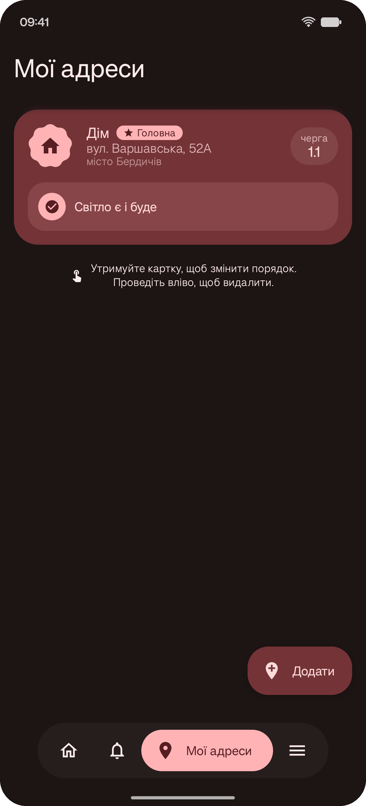
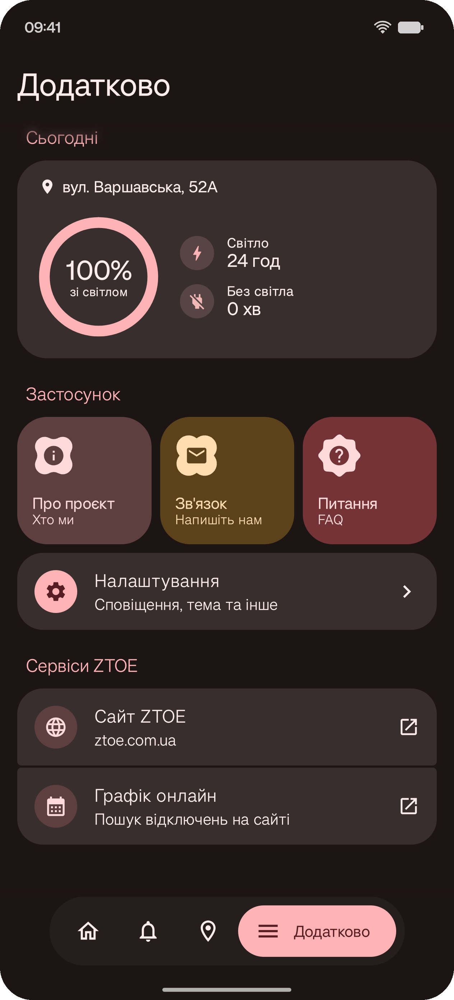

<p align="center">
  
</p>

<p align="center">
  <a href="https://github.com/dmitthedazed/SvitloYE/releases/latest"></a>
  <a href="https://github.com/dmitthedazed/SvitloYE/releases"></a>
  
  
  
  
  <a href="LICENSE"></a>
</p>

<p align="center">
  <b>Відкрив — і одразу бачиш, чи є світло вдома, коли його вимкнуть і коли повернуть.</b><br>
  Неофіційний Android-застосунок для графіків відключень АТ «Житомиробленерго» по всій області.
</p>

<p align="center">
  <a href="https://github.com/dmitthedazed/SvitloYE/releases/latest"><b>⬇️ Завантажити APK</b></a> ·
  <a href="https://dmitthedazed.github.io/SvitloYE/">🌐 Сайт</a> ·
  <a href="https://github.com/dmitthedazed/SvitloYE/issues">🐞 Повідомити про проблему</a>
</p>

---

## ✨ Що вміє

<table>
  <tr>
    <td align="center" width="25%"></td>
    <td align="center" width="25%"></td>
    <td align="center" width="25%"></td>
    <td align="center" width="25%"></td>
  </tr>
  <tr>
    <td valign="top"><b>💡 Статус зараз</b><br><sub>Велика картка «Світло є / немає», час до наступної зміни та підсумок дня для вашої черги.</sub></td>
    <td valign="top"><b>📢 Офіційні новини</b><br><sub>Оголошення Житомиробленерго прямо в застосунку — з посиланням на першоджерело.</sub></td>
    <td valign="top"><b>📍 Кілька адрес</b><br><sub>Дім, робота, батьки. Пошук за адресою, геолокацією або QR-кодом, перетягування та свайп для видалення.</sub></td>
    <td valign="top"><b>📊 Статистика дня</b><br><sub>Скільки годин зі світлом і без, швидкий доступ до налаштувань і сервісів ZTOE.</sub></td>
  </tr>
</table>

### А ще

- 🔔 **Розумні сповіщення** — попередження перед вимкненням і ввімкненням, сповіщення про зміну графіка, постійний статус у шторці.
- 🧩 **Віджети** — компактний статус, картка з поточним станом і детальний графік на день.
- ⚡ **Плитка швидких налаштувань** — статус світла в один свайп.
- 🚗 **Android Auto** — графік на екрані автомобіля.
- 🎨 **Material You** — динамічні кольори з шпалер, світла й темна теми.
- 🗺️ **Вся область** — не лише Житомир: Бердичів, Коростень, Звягель і всі населені пункти ZTOE.

## 🆕 Що нового у 2.0

- Повністю переписана система сповіщень: точні будильники, детектор змін графіка, менше дублів.
- Нові віджети на Glance з адаптивним дизайном.
- Оновлений інтерфейс на Material 3 Expressive, нова навігація та новий логотип.
- Анімований splash-екран і переосмислений онбординг.
- Коректна робота з часовим поясом Києва незалежно від налаштувань телефону.

## 📥 Встановлення

1. Завантажте `app-debug.apk` з останнього **[релізу](https://github.com/dmitthedazed/SvitloYE/releases/latest)**.
2. Дозвольте встановлення з невідомих джерел, якщо Android попросить.
3. Відкрийте застосунок, оберіть адресу — готово.

> **Важливо:** це неофіційний застосунок, створений для зручності мешканців. Дані беруться з відкритих джерел АТ «Житомиробленерго». У разі розбіжностей орієнтуйтеся на [ztoe.com.ua](https://www.ztoe.com.ua).

## 🛠️ Під капотом

| | |
|---|---|
| **Мова** | Kotlin |
| **UI** | Jetpack Compose · Material 3 Expressive |
| **Архітектура** | Clean Architecture + MVVM |
| **Мережа** | Retrofit |
| **Фонова робота** | AlarmManager · WorkManager · Foreground Service |
| **Віджети** | Jetpack Glance |
| **Сканер QR** | CameraX + ML Kit |
| **Авто** | Android for Cars App Library |
| **Min SDK** | 26 (Android 8.0) |

### Збірка

```bash
./gradlew assembleDebug
```

Потрібен JDK 21.

---

<p align="center"><sub>Розроблено з турботою про енергонезалежність 🇺🇦</sub></p>
